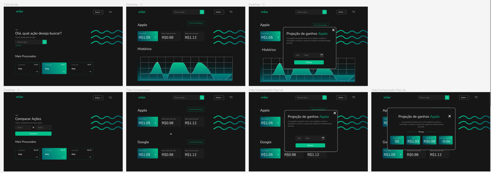
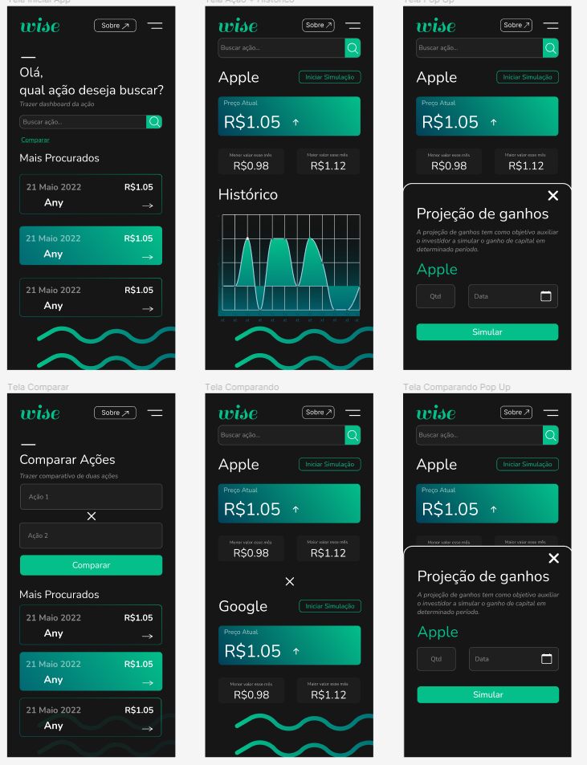

# Descrição

Uma corretora de ações está desenvolvendo um sistema para permitir que pequenos investidores possam tomar decisões melhores sobre seu portfólio. Uma das funcionalidades importantes é a de 
verificar o desempenho de uma ação nos seguintes cenários:

   - Preço atual;
   - Preço histórico;
   - Preço atual em comparação a outras ações;
   - Projeção de ganhos com compra em data específica.

Para isso, a equipe de software da empresa optou por desenvolver duas aplicações: um serviço de backend especializado nesses requisitos (que permitirá que essas funcionalidades sejam reutilizadas em outros produtos da empresa) e um dashboard configurável que dará visibilidade aos dados. Sua missão para este teste é implementar o frontend dessas partes.

A ideia é implementar algo simples, sem preocupações com dividendos, taxas administrativas ou outras incumbências que afetariam o montante total. Sendo assim, pressuponha que a compradora deseja saber o quanto teria ganhado ou perdido se tivesse investido seu dinheiro numa determinada quantidade de ações de uma empresa em alguma data no passado.

# Passo a passo para rodar
### `yarn` ou `npm i`

  Para instalar as dependencias do projeto, executar na pasta wisestock

   ### `yarn start`

   Iniciando projeto em modo desenvolvedor.\
   Abra [http://localhost:3000](http://localhost:3000) para ver a aplicação.

  ### `yarn test`
  
  Para executar os testes

# Considerações
- Iniciado 20/05, finalizado 23/05;
- Responsividade feita;
- Utilizado 
Axios para fazer as requisições a api;
- Extruturado o Desing do site no dia 20/05 no Figma. [Desing no figma](https://www.figma.com/file/Sid5oJxP8WmPlQC4qX6bta/Projeto-Wise-A%C3%A7%C3%B5es?node-id=0%3A1) ;
- Para testar manulamente, utilizar nomes de ações como: A, F, S ANY...(pego do backEnd);

